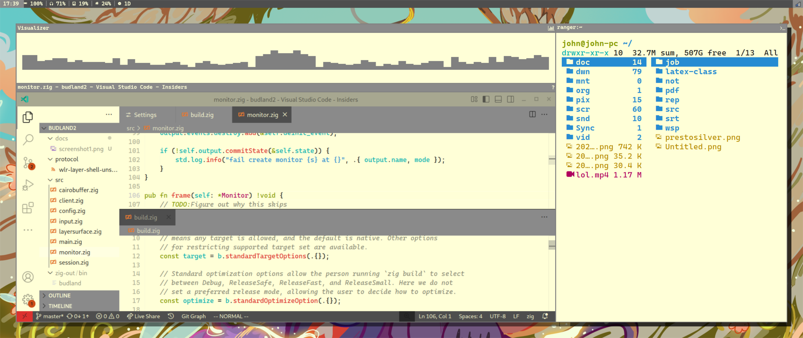
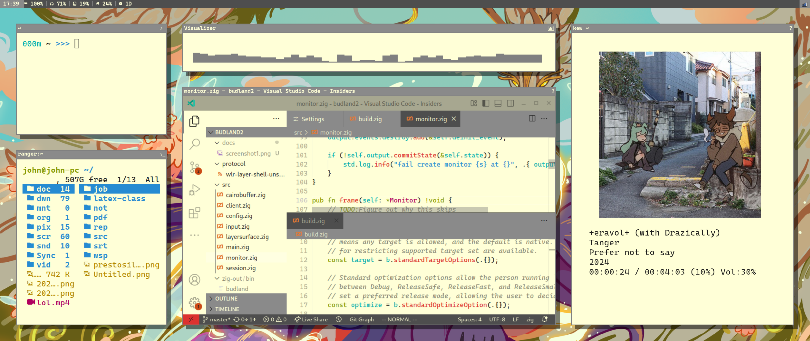
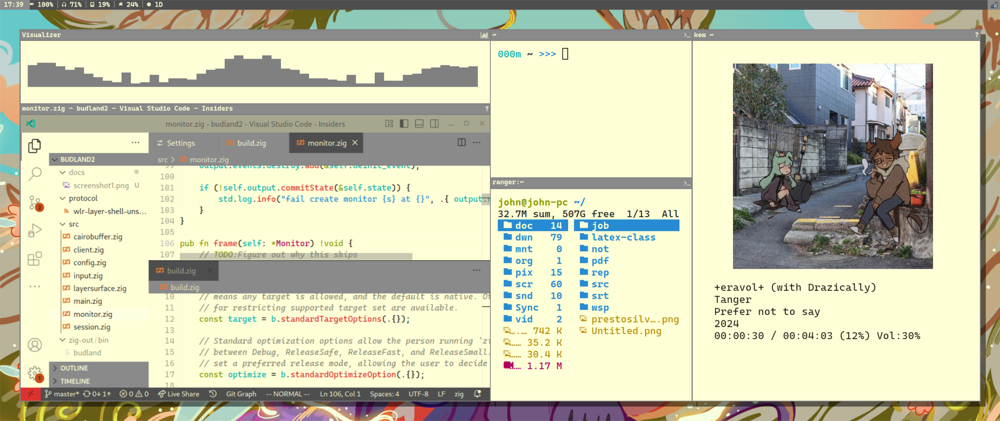

# Con-positor

## Install

To install this just clone the repo and install it using zig build, the dependencies will be fetched with the repo.

The full command I use is this:
`zig build -p /usr -Doptimize=ReleaseFast`

> [!WARNING]
> Never copy past code from the internet. This command will install files directly to your /usr folder, If you want to inspect your build run zig build and look in the `zig-out` folder

## About

Conpositor is a wayland compositor where you dont have to move your windows. I made this because I got sick of manually arranging all my windows in I3. It is different from tiling in one key way. Rather than allowing the user to move windows manually, arrange splits, and layout their windows, conpositor lets them define "containers" in their config. These containers can have different layouts, but can not be moved without redefining them in the config.

## Config

More documentation to come later, for now see [the sample config.](docs/init.lua)

## Screenshots

We have window frames for every environment you can think of!

### Sparse

### Busy

### Busy and Dense

